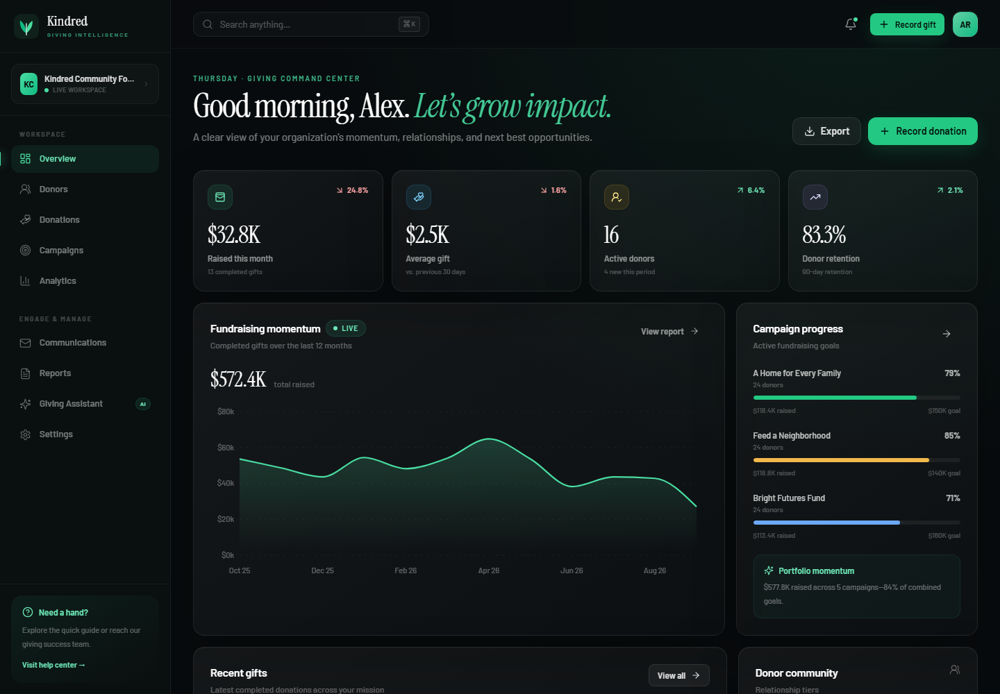
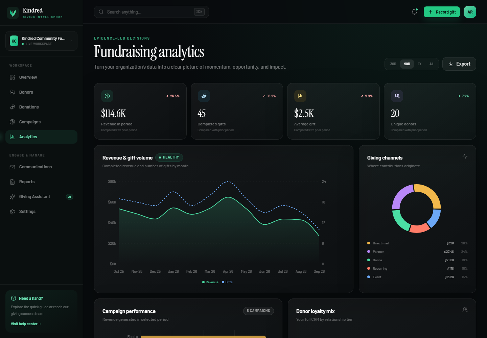
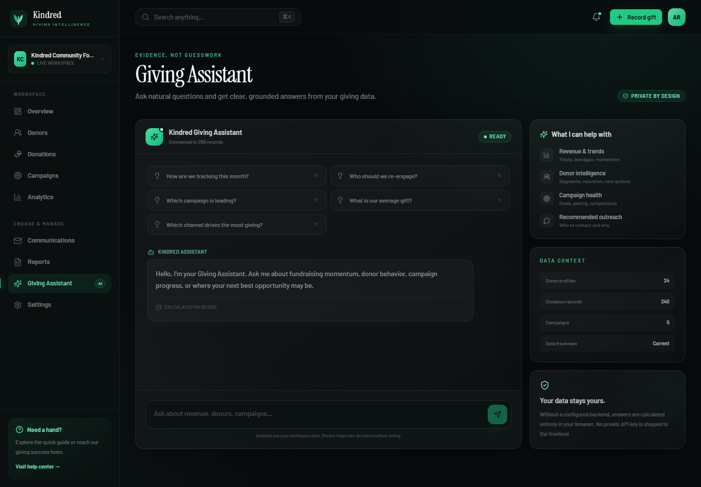

<div align="center">


<h1>Kindred Giving</h1>
<h3>Turn every contribution into lasting community impact.</h3>

<p>
Kindred is a full-stack donation intelligence workspace that helps nonprofit teams understand their donors, grow campaigns, communicate with supporters, and make every gift count.
</p>

<p>
  <a href="https://eloquent-puppy-38d03f.netlify.app" target="_blank" rel="noopener noreferrer">
    
  </a>
  <a href="https://github.com/812021664/Non-Profit-organization" target="_blank" rel="noopener noreferrer">
    
  </a>
</p>

<p>
  <a href="https://github.com/812021664/Non-Profit-organization/stargazers"></a>
  <a href="https://github.com/812021664/Non-Profit-organization/network/members"></a>
  
  
  
  
</p>

</div>

---

## See Kindred in action

[](https://eloquent-puppy-38d03f.netlify.app)

> **Live demo:** [eloquent-puppy-38d03f.netlify.app](https://eloquent-puppy-38d03f.netlify.app)
>
> The Netlify build runs as the frontend demo. It uses browser persistence when the Spring API is not connected.

## The problem Kindred solves

Nonprofit teams often have donor records, gifts, campaigns, reports, and messages spread across disconnected tools. Kindred brings those relationships into one calm, visual workspace—so teams spend less time reconciling data and more time building trust.

| Mission need | How Kindred helps |
| :--- | :--- |
| **Know what is happening** | Live KPIs, recent gifts, campaign pacing, activity, and trend comparisons |
| **Understand supporters** | Searchable donor CRM, lifetime value, consent, relationship tiers, and gift history |
| **Grow campaigns** | Goals, progress, timelines, donor counts, campaign creation, and performance views |
| **Act on insight** | Retention signals, giving-channel analysis, recommended outreach, and a Giving Assistant |
| **Report with confidence** | Filter-aware CSV, JSON, print, and PDF-ready exports |
| **Work securely** | Validation, Flyway migrations, CORS controls, health checks, and local offline fallback |

## Product highlights

### A command center built for decisions

- Current-month revenue, average gift, active donors, retention, and period-over-period movement
- Twelve-month fundraising trend with completed-gift volume
- Campaign progress, recent donations, donor tiers, and organization activity in one view

### Relationships, not rows

- Fast donor search across names, email, locations, and tags
- Active, lapsed, and new relationship segmentation
- Lifetime giving, average gift, recent history, consent, and internal notes
- One-click CSV export for operational workflows

### Campaigns with a clear pulse

- Funding goals, raised totals, donor counts, dates, and campaign status
- Visual progress and performance comparisons
- Fast campaign creation with realistic validation

### Analytics that point to action

- Revenue and gift-volume trends
- Channel mix, donor loyalty, gift-size distribution, and retention
- Evidence-based insights for re-engagement and recurring giving

### Communication without the busywork

- Reusable impact, invitation, and monthly digest templates
- Consent-aware audience sizing
- Live preview, personalization tokens, and send history

### Reporting that travels

- Giving, donor, campaign, and finance report previews
- CSV for spreadsheets
- JSON for engineering and migrations
- Print/PDF for leadership and board meetings

### A privacy-minded Giving Assistant

- Answers common questions from the workspace data
- Works locally in the browser without exposing a model-provider secret
- Supports an optional authenticated backend endpoint for hosted AI

---

## Explore more of the product

<table>
<tr>
<td width="50%">

### Analytics

[](https://eloquent-puppy-38d03f.netlify.app/analytics)

Revenue, channels, campaigns, loyalty, and retention in one decision-ready view.

</td>
<td width="50%">

### Giving Assistant

[](https://eloquent-puppy-38d03f.netlify.app/assistant)

Ask grounded questions about momentum, donor behavior, and campaign health.

</td>
</tr>
</table>

## Technology

| Layer | Technology | Purpose |
| :--- | :--- | :--- |
| Frontend | React 18, TypeScript, Vite | Responsive application and route-level code splitting |
| Styling | Tailwind CSS, custom design tokens | Cinematic dark theme, glass UI, accessibility states |
| State | Zustand | Predictable domain state with browser persistence |
| Charts | Recharts | Responsive fundraising and donor visualizations |
| API | Spring Boot 3.5, Java 17 | Validated REST endpoints and domain synchronization |
| Persistence | Spring Data JPA, H2, PostgreSQL | Development and production-ready relational storage |
| Migrations | Flyway | Versioned, repeatable database schema |
| HTTP | Axios | Typed API access, timeout handling, and auth interceptor |
| Testing | Vitest, Spring MockMvc | Frontend units and backend integration flows |
| CI/CD | GitHub Actions | Type, lint, test, audit, and production builds |

## Architecture

```mermaid
flowchart LR
    U[Donor or team member] --> UI[React + TypeScript workspace]
    UI -->|Axios /api| API[Spring Boot REST API]
    UI -. API unavailable .> LOCAL[(Browser persistence)]
    API --> DB[(H2 or PostgreSQL)]
    API --> LEGACY[Legacy-compatible workflows]
    API --> FLYWAY[Flyway migrations]
```

Kindred synchronizes the browser workspace with the API when connected. Donor, donation, and campaign forms write through to the server. If the API is unavailable, work remains in the browser and the interface clearly switches to offline mode.

## Quick start

### Prerequisites

- [Node.js 20+](https://nodejs.org/)
- npm 10+
- [JDK 17+](https://adoptium.net/) for the API

### Run the complete application

```bash
git clone https://github.com/812021664/Non-Profit-organization.git
cd Non-Profit-organization
npm install
npm run dev:full
```

Open **http://localhost:5173**.

`dev:full` starts the Spring API, waits for `/actuator/health`, and then starts Vite with synchronized data.

### Frontend-only demo

```bash
npm run dev
```

The interface remains fully usable without the API. Changes persist in browser storage.

## Useful commands

| Command | What it does |
| :--- | :--- |
| `npm run dev` | Start Vite only |
| `npm run dev:full` | Start Spring Boot and the connected React app |
| `npm run server:dev` | Start only the API |
| `npm run server:test` | Run API integration tests |
| `npm run server:build` | Package the API |
| `npm run type-check` | Run strict TypeScript checks |
| `npm run lint` | Run ESLint with zero warnings allowed |
| `npm test` | Run frontend unit tests |
| `npm run build` | Create the optimized frontend bundle |
| `npm audit` | Verify the npm dependency audit |

## Project structure

```text
src/
├── components/           Application shell and reusable interface
├── data/                 Realistic demonstration records
├── hooks/                Domain, analytics, and synchronization hooks
├── lib/                  Analytics, calculations, formatting, and exports
├── pages/                Nine product modules
├── services/             Typed frontend API clients
├── store/                Persisted application and interface state
└── types/                Shared TypeScript domain contracts

server/
├── controller/           Modern and legacy-compatible REST endpoints
├── domain/               JPA entities
├── dto/                  Validated API records
├── repository/           Spring Data repositories
├── service/              Import, totals, synchronization, and legacy logic
└── resources/            Application configuration and Flyway migration

docs/                     Deployment, integration, and reference guides
scripts/                  Cross-platform development commands
```

## API integration

The Spring service exposes:

- `GET /api/status` and `GET /api/bootstrap`
- `POST /api/import` for idempotent client-ID upserts
- `GET/PUT /api/donors`, `/api/donations`, and `/api/campaigns`
- `POST /api/legacy/donors` and `/api/legacy/donations`
- `GET /api/legacy/reports`
- `GET /actuator/health`

Development uses file-backed H2 at `server/data/kindred.mv.db`. PostgreSQL can be enabled with the `postgres` profile and standard Spring datasource variables.

See:

- [`server/README.md`](server/README.md)
- [`docs/LEGACY_INTEGRATION.md`](docs/LEGACY_INTEGRATION.md)
- [`docs/DEPLOYMENT.md`](docs/DEPLOYMENT.md)
- [`SECURITY.md`](SECURITY.md)

## Netlify deployment

The frontend is live at:

### **[https://eloquent-puppy-38d03f.netlify.app](https://eloquent-puppy-38d03f.netlify.app)**

Netlify configuration included in the repository:

- Build command: `npm run build`
- Publish directory: `dist`
- SPA fallback through `public/_redirects`
- Production chunks for React, charts, and application routes

A full production deployment should host the Spring API separately and set:

```env
VITE_API_BASE_URL=https://api.example.org
```

Never place database, payment, email, signing, or private AI credentials in a `VITE_*` variable—those values are public in the browser bundle.

## Quality status

```text
TypeScript ............... passed
ESLint ................... passed
Frontend unit tests ....... 4 passed
Production frontend build  passed
Spring API tests .......... 3 passed
Spring production build ... passed
npm dependency audit ...... 0 known vulnerabilities
```

## Contributing

Contributions are welcome. Please keep changes focused, tested, accessible, and secure.

1. Fork the repository
2. Create a feature branch
3. Run frontend and backend checks
4. Open a pull request with a clear summary

## Upstream project

Kindred preserves and expands the original donor, category-based donation, and total-report workflows from the individual Java project integrated at:

**[812021664/Non-Profit-organization](https://github.com/812021664/Non-Profit-organization)**

Migration details are documented in [`docs/LEGACY_INTEGRATION.md`](docs/LEGACY_INTEGRATION.md) and attribution in [`UPSTREAM.md`](UPSTREAM.md).

## License

No open-source license has been declared by the repository owner. Add an appropriate license before public redistribution.

---

<div align="center">
  <strong>Built for teams who believe every gift can become something lasting.</strong><br><br>
  <a href="https://eloquent-puppy-38d03f.netlify.app">Explore Kindred</a> · <a href="https://github.com/812021664/Non-Profit-organization">Star on GitHub</a>
</div>
